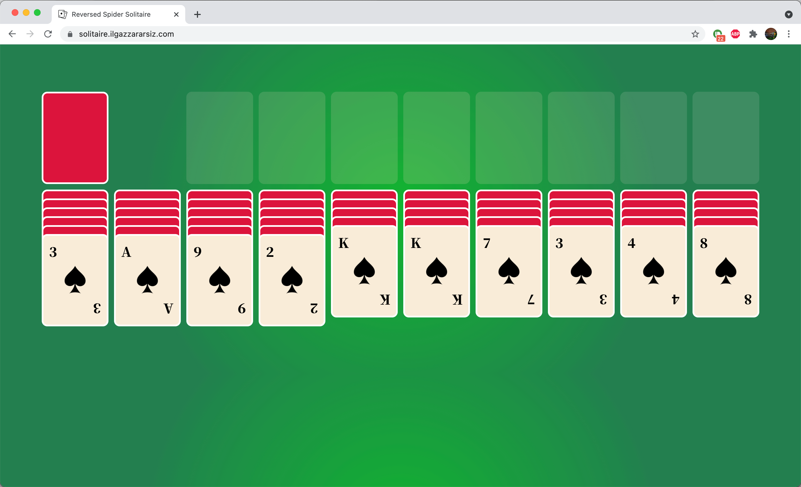

# Reversed Spider Solitaire

## Content of Project
- Reversed version of traditional spider solitaire game made with React.

## How to play
- Users can drag and drop cards from A to K in ascending order.



## Demo

[Reversed Spider Solitaire](https://solitaire.ilgazzararsiz.com/)

To run the project on local:

First:

```bash
npm install
```
Then:

```bash
npm start
```
Project will run on [http://localhost:3000](http://localhost:3000).

To test the project:
```bash
npm test
```